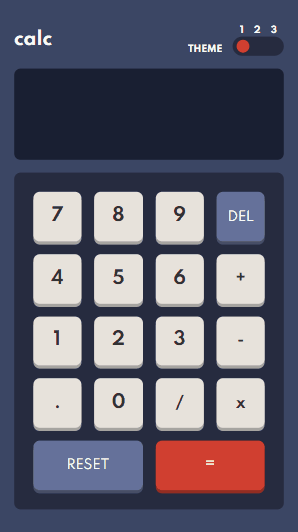
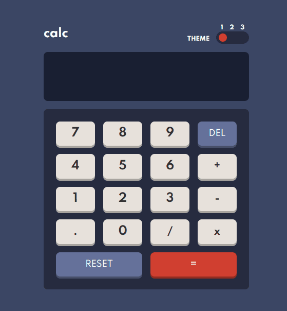

<h1 align="center">➕ Web Calculator ➗</h1>

A styled way to calculate everything you want on web
  
  <h4 align="center">Project finished ✔️</h4>

 
 

  <a href="#about">About</a> •
  <a href="#features">Features</a> •
  <a href="#preview">Preview</a> •
  <a href="#requirements">Requirements</a> •
  <a href="#technologies">Technologies</a>

<h2 id="about">About 🔍</h2>

This project is a way to practice the web development knowledge acquired. The entire design was developed by <a href="https://www.frontendmentor.io/challenges">Frontend Mentor</a>.

<h2 id="features">Features ☑️</h2>

- [x] Change color theme
- [x] Buttons animation
- [ ] Advanced operations

<h2 id="preview">Preview 👀</h2>

on <a href="https://victoroliverc.github.io/WebCalculator/">GitHub Pages</a> 

  
  

<h2 id="requirements">Requirements ☑️</h2>

- Nothing, you just have to click on the link and enjoy the application

<h2 id="technologies">Technologies used 💻</h2>

- HTML5
- CSS3
- JavaScript

